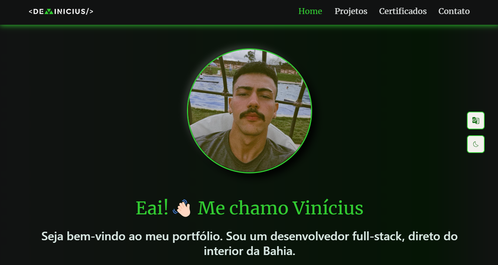

# My Portfolio

Welcome to my personal portfolio! This is a space where I share information about myself, my work, and previous projects. Feel free to explore and learn more about my journey as a developer.

## Content

- [Overview](#overview)
- [Technologies Used](#technologies-used)
- [Featured Projects](#featured-projects)
- [How to Contact](#how-to-contact)
- [License](#license)

## Overview

This portfolio was created to showcase my skills, experiences, and projects. Here, you will find information about my education, professional background, and a selection of projects that demonstrate my abilities and knowledge.

You can also check out the live demo of the portfolio [here!](https://my-portfolio-rust-eight-80.vercel.app/)

## Technologies Used and Features

- **TypeScript**: JavaScript superset that adds static typing.
- **React**: Library for building UI.
- **Vite**: Fast build tool for modern projects.
- **Axios**: HTTP client for making requests.
- **Tanstack Query**: Library for asynchronous state management and data caching.
- **Zustand**: Library for client-side state management.
- **React Hook Form**: Library for form management and validation.
- **Zod**: Library for schema validation and type inference.
- **MUI (Material-UI)**: UI component library.
- **SASS**: CSS preprocessor for styling, using mixins and variables.

## Works

Here are some of the highlighted works and projects I've developed:

1. **Snow Pet Shop**: A management system for a local pet shop

   - [Project Link](snow-pet.vercel.app)
   - [Source Code](https://github.com/viniciussis/Snow_Pet)

2. **URL Short**: A landing page integrated with the Clean URI API

   - [Project Link](https://url-short-coral-two.vercel.app/)
   - [Source Code](https://github.com/viniciussis/URL_Short)

3. **Virtual Space**: A mini blog developed in React

   - [Project Link](https://virtual-space-viniciussis-projects.vercel.app/)
   - [Source Code](https://github.com/viniciussis/Virtual_Space.git)

## How to Contact

I'm always open to chatting and collaborating on interesting projects. You can reach out to me through the following channels:

- Email: vinicius01012@gmail.com
- LinkedIn: [\_viniciussis](https://www.linkedin.com/in/_viniciussis)
- GitHub: [\viniciussis](https://github.com/viniciussis)
- Instagram: [\_devinicius](https://www.instagram.com/_devinicius/)
- Twitter: [\_devinicius](https://x.com/_devinicius)

Feel free to contact me if you have any questions, ideas, or collaboration opportunities!

## Contributing

Feel free to contribute or open issues for suggestions and bug fixes. Pull requests are welcome!

## License

This project is licensed under the [MIT License](LICENSE).

---

**Developed by Vinícius Silva Santos**
